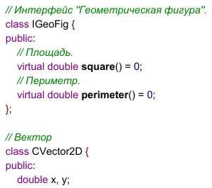
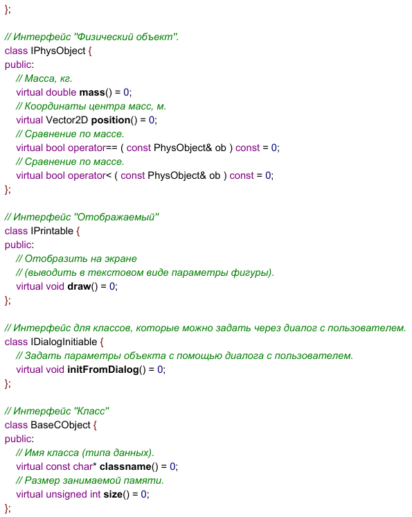

# Лабораторная работа №4. “Виртуальные функции”.
## Реализовать все указанные интерфейсы (абстрактные базовые классы) для классов:
### D) Прямоугольник. H) Эллипс.
## Функционал системы: 
### Хранение множества фигур. Динамическое добавление фигур пользователем (через консоль).Отобразить все фигуры. Суммарная площадь всех фигур. Суммарный периметр всех фигур. Центр масс всей системы. Память, занимаемая всеми экземплярами классов. Сортировка фигур между собой по массе.
